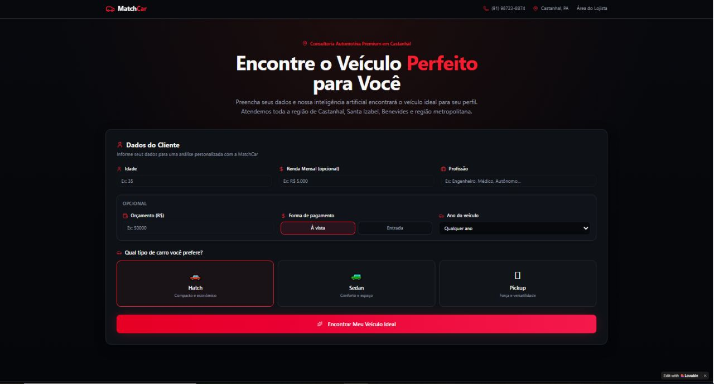
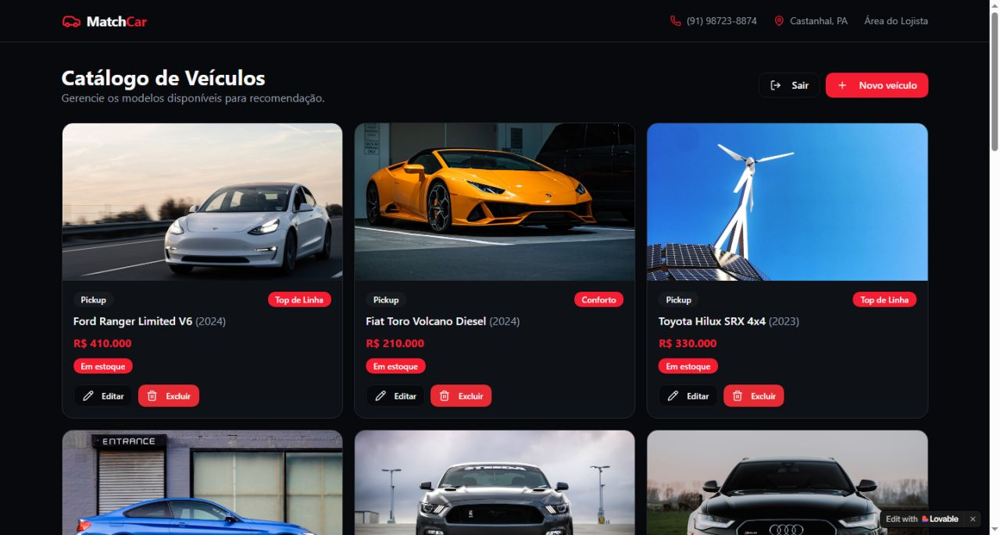

# 🚗 MatchCar: Inteligência Analítica para o Setor Automotivo
> **Grupo DealerData** — Projeto de Extensão Universitária | Castanhal/PA


[](https://match-car.lovable.app)

O **MatchCar** é um ecossistema de recomendação inteligente desenvolvido especificamente para o mercado de seminovos de Castanhal/PA. O sistema utiliza uma arquitetura híbrida que combina **Engenharia de Big Data**, **Machine Learning** e **Inteligência Artificial Generativa** para conectar o perfil socioeconômico e as preferências do cliente ao veículo ideal em estoque, otimizando a conversão de vendas e acelerando o giro de pátio.

---

## 🔗 Links do Projeto

* 🚀 **Sistema Online:** [match-car.lovable.app](https://match-car.lovable.app)
* 💾 **Repositório Backend Engine:** [GitHub - car-advisor-pro](https://github.com/EldinhoJBL/car-advisor-pro.git)

---

## 📸 Demonstração do Sistema

| Homepage (Formulário de Perfil do Cliente) | Painel Administrativo (Controle do Lojista) |
| :---: | :---: |
|  |  |
| *Interface de captura do cliente final* | *Painel privado de gestão do lojista* |

---

## 💼 Objetivos e Valor de Negócio

* **Qualificação de Leads:** Automação da captura e análise do perfil financeiro do cliente para entregar ao consultor de vendas um lead com alto potencial de fechamento.
* **Otimização de Estoque:** Algoritmo que acelera o giro do pátio ao priorizar inteligentemente os veículos físicos da loja.
* **Redução de Atrito:** Interface pública projetada para o cliente final obter respostas imediatas sem a necessidade de cadastros prévios, aumentando o volume de conversão.

---

## ✨ Funcionalidades Principais

* **Modelagem Preditiva de Categoria:** Motor de Machine Learning baseado no algoritmo **Random Forest Classifier** que analisa variáveis socioeconômicas (Idade, Profissão, Salário) para predizer a categoria ideal de veículo (Hatch, Sedan ou Pickup).
* **Algoritmo de Priorização de Estoque:** Lógica customizada que varre o estoque e aplica pesos matemáticos para garantir que veículos de origem manual (pátio físico da loja) tenham prioridade máxima de exibição.
* **Filtro de Viabilidade Financeira:** Aplicação rígida da regra de negócio do **Teto de Compra Fixo**, limitando as buscas à capacidade financeira real do lead:
  $$\text{Teto Total} = (\text{Salário Mensal} \times 20) + \text{Orçamento Informado}$$
* **Recomendação Estratégica em Dois Tiers:** O sistema seleciona e apresenta simultaneamente duas opções ideais dentro do teto calculado:
  * **Custo-Benefício:** O veículo em estoque mais próximo de 70% do teto financeiro total.
  * **Conforto:** A melhor opção de veículo que atinge o limite máximo do orçamento disponível.
* **Análise de Realismo e Validação de Mercado:** Cruzamento de dados em tempo real com o histórico de preços de mercado (`market_prices`), calibrando o prompt enviado ao **Gemini 2.5 Flash** para garantir argumentos comerciais realistas e alinhados à tabela FIPE.

---

## 🛠️ Arquitetura Tecnológica e Stack

O projeto utiliza uma arquitetura distribuída e de alta performance, dividida em camadas especializadas:

### 1. Data Engine & Machine Learning (Backend)

* **Python 3:** Linguagem central utilizada para engenharia de dados, modelagem matemática e integrações de IA.
* **Apache Spark & Pandas:** Ferramentas aplicadas no processamento massivo, limpeza e manipulação da base de dados de preços de mercado (`market_prices`).
* **Scikit-Learn:** Pipeline de dados composto por `StandardScaler` (normalização), `TfidfVectorizer` (processamento de texto para o campo de profissões) e o classificador `Random Forest`.
* **Flask & Pyngrok:** Micro-framework responsável por expor o endpoint seguro `/api/recomendar`, utilizando tunelamento para comunicação externa com o frontend.
* **Google Gemini 2.5 Flash:** Integração via **Lovable AI Gateway** para a inteligência analítica de vendas e geração de descrições automáticas de catálogo.

### 2. Interface e Aplicação (Frontend)

* **React 19 & TypeScript:** Interface robusta, tipada e performática desenvolvida com o auxílio da plataforma Lovable.dev.
* **TanStack Router:** Gerenciamento de rotas baseado em arquivos do sistema (`/`, `/login`, `/admin`).
* **TanStack Query:** Controle de estado global, cache assíncrono de dados e manipulação de estados de carregamento.

### 3. Persistência & Segurança (BaaS)

* **Supabase Postgres:** Banco de dados relacional responsável por armazenar as tabelas estruturadas do ecossistema.
* **Supabase Auth & RLS:** Sistema de autenticação seguro via e-mail e senha, com políticas estritas de *Row Level Security* (Segurança em Nível de Linha).
* **Supabase Storage:** Armazenamento binário estruturado no bucket `vehicle-images` para gerenciamento das fotos do catálogo.

---
## 📁 Estrutura do Repositório

```text
├── src/               # Interface frontend (Aplicação React/TypeScript)
├── engine/            # API Flask (Motor de inteligência, Machine Learning e Spark)
├── supabase/          # Migrações e políticas do banco de dados PostgreSQL
├── public/            # Ativos estáticos e capturas de tela
├── .lovable/          # Histórico e instruções de automação do Lovable
├── .env.example       # Modelo para variáveis de ambiente
└── README.md          # Documentação do projeto
```

---

## 💻 Como Rodar Localmente

Siga as instruções abaixo para configurar e executar o projeto no seu ambiente de desenvolvimento.

### 1. Clonar o Repositório
Abra o seu terminal e execute os comandos abaixo para baixar o código e entrar na pasta do projeto:

```bash
git clone [https://github.com/EldinhoJBL/car-advisor-pro.git](https://github.com/EldinhoJBL/car-advisor-pro.git)
cd car-advisor-pro
```

### 2. Instalar Dependências (Frontend)
Com o Node.js instalado na sua máquina, instale os pacotes necessários da interface:

```bash
npm install
```

### 3. Configurar Variáveis de Ambiente
Crie um arquivo chamado `.env` na raiz do projeto e configure as suas chaves de API e banco de dados:

```env
VITE_SUPABASE_URL=sua_url_aqui
VITE_SUPABASE_ANON_KEY=sua_chave_aqui
VITE_GEMINI_API_KEY=sua_chave_ia_aqui
```

### 4. Iniciar o Servidor Frontend
Inicie a aplicação em modo de desenvolvimento:

```bash
npm run dev
```

### 5. Executar a Engine de IA (Backend)
Abra o arquivo da API localizado na pasta `/engine` dentro do seu ambiente Python (ou Google Colab), configure o seu `NGROK_AUTH_TOKEN` e execute o script para disponibilizar o ponto de acesso `/api/recomendar`.

---

## 👥 Equipe de Desenvolvimento (Grupo DealerData)

Conheça os membros responsáveis pela engenharia e arquitetura do ecossistema:

* 🧑‍💻 **Elder Gomes(Líder de Projeto & Desenvolvedor Principal / Lead Engineer)**
Atuação: Liderança estratégica do projeto e principal desenvolvedor do ecossistema. Atuou transversalmente na arquitetura fullstack, no desenvolvimento das regras de negócio e algoritmos na Engine Python (Machine Learning e Flask), na estruturação do banco de dados Supabase e na integração das Server Functions com a interface em React.
* 🧑‍💻 **Erlan Moura(Cientista de Dados Co-desenvolvedor)**
Atuação: Codesenvolvimento focado em pesquisa analítica, engenharia de recursos (Feature Engineering), análise estatística exploratória e apoio na modelagem matemática do classificador preditivo.
* 🧑‍💻 **Halysson Silva(Engenheiro de Dados Co-desenvolvedor)**
Atuação: Codesenvolvimento focado no pipeline de dados, atuando no tratamento, modelagem de tabelas e carga massiva da base de inteligência de mercado utilizando a infraestrutura do Apache Spark.  
* 🧑‍💻 **Vinicius Gabriel(Desenvolvedor Frontend / UI-UX)**
Atuação: Desenvolvimento focado na experiência do usuário, refinamento de componentes responsivos na interface React/Tailwind e mapeamento dos fluxos visuais de captura de leads.
```
